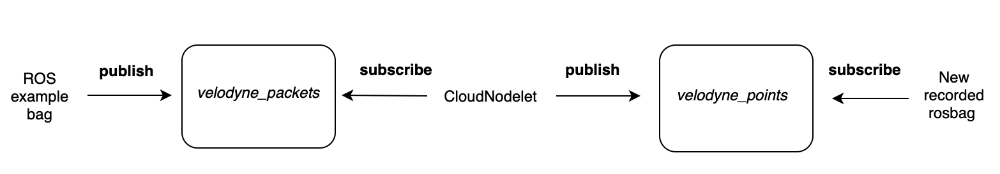

## Transforming Lidar Data 
The LiDAR data for the FieldSafe dataset was recorded using a Velodyne HDL-32E lidar scanner and recorded as velodyne msgs/VelodyneScan ROS messages. This message
format contains only the raw UDP packet data and consequently requires significant processing to bring structure to the data. A ROS nodelet from the velodyne pointcloud package was used to convert from raw Velodyne packets to PointCloud2 format. 

### Processing Raw Velodyne Data
The first stage of the investigation details the development of a comprehensive evaluation pipeline designed to evaluate each depth network from a qualitative and quantitative perspective. Each depth network was evaluated on both the structured environment KITTI dataset and unstructured environment FieldSafe and ACFR datasets.

### Extracting PointCloud messages to PCD files
The second stage explores network behaviour and underlying depth network mechanisms in order to determine the challenges specific to unstructured environments and the network features more suited to these challenges. The results were interpreted through a saliency, statistical and comparative analysis.

### Projecting to Camera View
The final phase of the investigation includes an exploration into the possibility of using transfer learning to adapt existing networks from the structured to unstructured domain. Transfer learning was applied by finetuning specific layers of the depth network.

### Converting to a 16-bit Grayscale Depth Image 
In order to ensure compatibility with the evaluation pipeline, the projected lidar points were converted to the standard 16-bit greyscale depth format. The conversion was performed by multiplying each depth value by 256 and saving the image array as 16-bit integer values.

