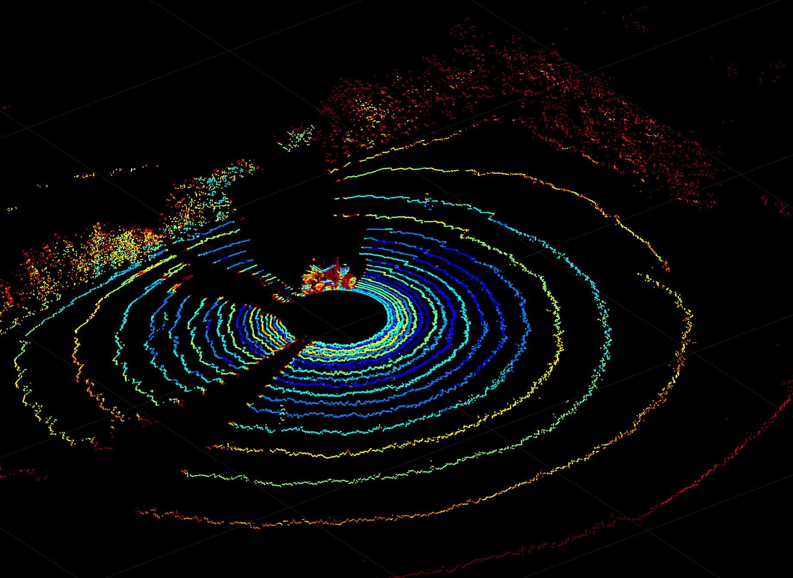
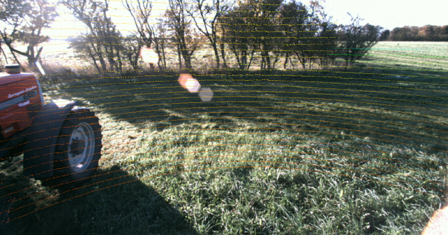
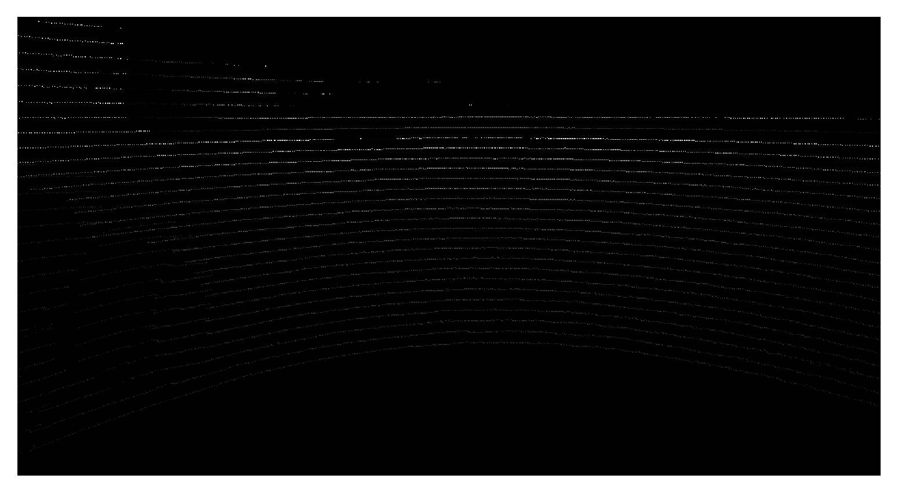

## Transforming Lidar Data 
The LiDAR data for the FieldSafe dataset was recorded using a Velodyne HDL-32E lidar scanner and recorded as velodyne msgs/VelodyneScan ROS messages. This message
format contains only the raw UDP packet data and consequently requires significant processing to bring structure to the data. 

### Processing Raw Velodyne Data
A ROS nodelet from the velodyne_pointcloud package was used to convert from raw Velodyne packets to PointCloud2 format.

### Extracting PointCloud messages to PCD files
The PointCloud2 messages were then converted to Point Cloud Data (PCD) format using the pcl_ros package.

### Projecting to Camera View
The final step in the lidar processing pipeline was to project the 3D lidar point cloud onto the relevant camera view.

### Converting to a 16-bit Grayscale Depth Image 
In order to ensure compatibility with the evaluation pipeline, the projected lidar points were converted to the standard 16-bit greyscale depth format. The conversion was performed by multiplying each depth value by 256 and saving the image array as 16-bit integer values.

