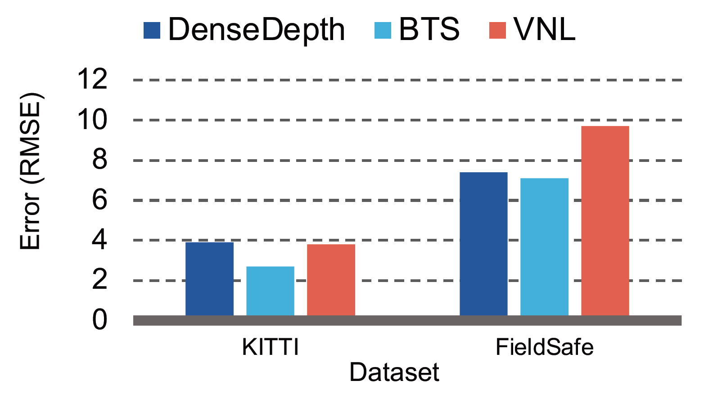

# Depth-Networks-In-Unstructured-Scenes
Final Year Research Project investigating the performance of monocular depth estimation networks in unstructured environments.

## Investigative Stages
Three State of the Art depth estimation networks were analysed according to the following investigative phases:

### Evaluation
The first stage of the investigation details the development of a comprehensive evaluation pipeline designed to evaluate each depth network from a qualitative and quantitative perspective. Each depth network was evaluated on both the structured environment KITTI dataset and unstructured environment FieldSafe and ACFR datasets.

### Intepretation
The second stage explores network behaviour and underlying depth network mechanisms in order to determine the challenges specific to unstructured environments and the network features more suited to these challenges. The results were interpreted through a saliency, statistical and comparative analysis.

### Adaptation
The final phase of the investigation includes an exploration into the possibility of using transfer learning to adapt existing networks from the structured to unstructured domain. Transfer learning was applied by finetuning specific layers of the depth network.

## State of the Art
The three depth networks investigated include:

- [DenseDepth](https://github.com/ialhashim/DenseDepth) network by Alhashim et al. 
- [BTS](https://github.com/cogaplex-bts/bts/tree/master/pytorch) network by Lee et al. 
- [VNL](https://github.com/YvanYin/VNL_Monocular_Depth_Prediction) network by Yin et al. 

## Results
The VNL network was shown to be least effective in unstructured environments as it showed the greatest variability in accuracy.

